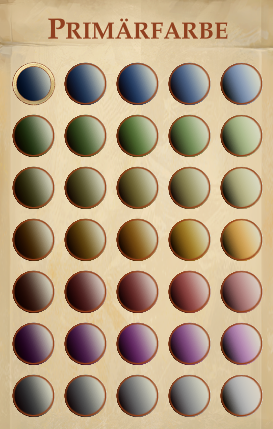

## JSON Structure for Character Class

| Key                      | Required  | Example                            | Description |
|--------------------------|-----------|------------------------------------|-------------|
| Guid                     | true      | "4da4a7d55cee43608a64babeb8d3ca73" | A 32 character GUID |
| Name                     | true      | "CharlatanClass"                   | The name of the character class, used internally |
| From                     | false     | "ref:BARD"                         | Default: nothing; The reference of a character class to use as a template for this one |  
| DisplayName              | true      | "Charlatan"                        | The name of the character class that is shown to the users |
| Description              | false     | "This is a cool character class."  | The description of the character class |
| Icon                     | false (1) | "ref:ROGUE"                        | Icon representation of the character class, taken from another character class. Use "ref:<IDENTIFIER>" where <IDENTIFIER> is one of the character class identifiers listed below |
| EquipmentEntities        | false (1) | "ref:ROGUE"                        | Equipment of the character class' doll, taken from another character class. Use "ref:<IDENTIFIER>" where <IDENTIFIER> is one of the character class identifiers listed below |
| MaleEquipmentEntities    | false     | "ref:ROGUE"                        | See EquipmentEntities, default is the same as for EquipmentEntities if not defined otherwise |
| FemaleEquipmentEntities  | false     | "ref:ROGUE"                        | See EquipmentEntities, default is the same as for EquipmentEntities if not defined otherwise |
| PrimaryColor             | false (1) | 0                                  | The character class' primary color as int, see color table for values |
| SecondaryColor           | false (1) | 19                                 | The character class' secondary color as int, see color table for values |
| SkillPoints              | false (1) | 5                                  | The skill points a character recieves on a new level |
| HitDie                   | false     | "D8"                               | Default: D6; The hit die the character uses. The value has to be one of the hit die identifiers listed below |
| BaseAttackBonus          | false     | "ref:BAB_LOW"                      | Default: BAB_LOW; How the base attack bonus grows when the character level. Use "ref:<IDENTIFIER>" where <IDENTIFIER> has to be one of the base attack bonus identifiers listed below |
| FortitudeSave            | false     | "ref:SAVES_LOW"                    | Default: SAVES_LOW; How the fortidude bonus grows when the character level. Use "ref:<IDENTIFIER>" where <IDENTIFIER> has to be one of the save roll identifiers listed below |
| WillSave                 | false     | "ref:SAVES_HIGH"                   | Default: SAVES_LOW; How the fortidude bonus grows when the character level. Use "ref:<IDENTIFIER>" where <IDENTIFIER> has to be one of the save roll identifiers listed below |
| ReflexSave               | false     | "ref:SAVES_LOW"                    | Default: SAVES_LOW; How the fortidude bonus grows when the character level. Use "ref:<IDENTIFIER>" where <IDENTIFIER> has to be one of the save roll identifiers listed below |
| IsDivineCaster           | false     | false                              | Default: false; Specifies if the character class is a divine caster |
| IsArcaneCaster           | false     | false                              | Default: false; Specifies if the character class is an arcane caster |
| ComponentsArray          | false     | "ref:ROGUE"                        | Default: nothing; Components of the character class, taken from another character class. This is not required and can be left out. Use "ref:<IDENTIFIER>" where <IDENTIFIER> is one of the character class identifiers listed below |
| StartingGold             | false     | 500                                | Default: 411; The amount of gold your character starts with |
| StartingItems            | false     | "ref:ROGUE"                        | Default: nothing; The items your character starts with, taken from another character class. Use "ref:<IDENTIFIER>" where <IDENTIFIER> is one of the character class identifiers listed below |
| Alignment                | false     | [ "NeutralGood", "ChaoticGood" ]   | Default: Any; The possible alignments for the character starts. Not listed alignments are not allowed. The values has to be from the alignment identifiers listed below |
| ClassSkills              | false     | [ "Thievery", "Stealth" ]          | Default: nothing; The skills to use as class skills for the character starts. The values has to be from the skill identifiers listed below |
| RecommendedAttributes    | false     | [ "Dexterity", "Charisma" ]        | Default: nothing; The attributes recommended for the character starts. The values has to be from the attributes identifiers listed below |
| NotRecommendedAttributes | false     | [ "Dexterity", "Charisma" ]        | Default: nothing; The attributes not recommended for the character starts. The values has to be from the attributes identifiers listed below |

(1) these attributes are required if the spellbook is not cloned from another one

### Character Class Identifiers 

Possible values:

- ALCHEMIST
- BARBARIAN
- BARD
- CLERIC
- DRUID
- FIGHTER
- INQUISITOR
- KINETICIST
- MAGUS
- MONK
- PALADIN
- RANGER
- ROGUE
- SLAYER
- SORCERER
- WIZARD    

### Hit Die Identifiers

Possible values

- Zero
- One
- D2
- D3
- D4
- D6
- D8
- D10
- D12
- D20
- D100

(Only D6, D8, D10 make sense ;-)

### Base Attack Bonus Identifiers

Possible values:

- BAB_LOW
- BAB_MEDIUM
- BAB_FULL

### Save Roll Identifiers

Possible values:

- SAVES_LOW
- SAVES_HIGH

### Alignment Identifiers

Possible values:

- LawfulGood
- NeutralGood
- ChaoticGood
- LawfulNeutral
- TrueNeutral
- ChaoticNeutral
- LawfulEvil
- NeutralEvil
- ChaoticEvil
- Good
- Evil
- Lawful
- Chaotic
- Any

### Skill Identifiers

Possible values:

- Athletics
- Perception
- Thievery
- Stealth
- KnowledgeArcana
- KnowledgeWorld
- LoreNature
- LoreReligion
- Persuasion
- UseMagicDevice

### Attribute Identifiers

Possible values:

- Strength
- Dexterity
- Constitution
- Intelligence
- Wisdom
- Charisma

### Color Table

Possible values: 0-34

See this table, where the first row is from 0-4, the second row from 5-9, and the last row from 30-34. 

